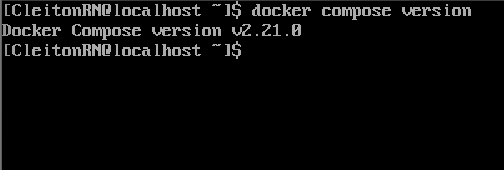
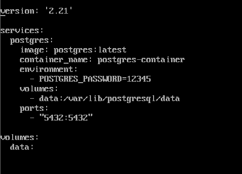
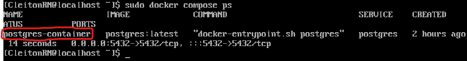
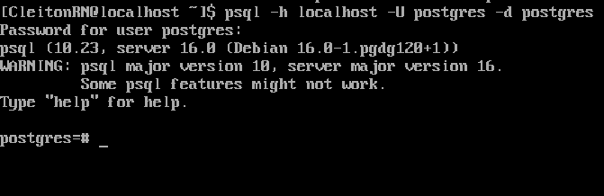

<p align="center">
  <a href="" rel="noopener">
 </a>
</p>

<h1 align="center">Criando uma imagem do PostgreSQL no Docker</h1> 
<p align="center"><i>Criando uma imagem do PostgreSQL no Docker, utilizando Docker Compose, rodando a imagem e persistindo os dados do DB em um volume.</i></p>

## Desafios anteriores:
- [Desafio 1 - Instalando Docker em uma VM Oracle Linux](https://github.com/CleitonOS/compass-docker-desafio1)

## 📝 Tabela de conteúdos
- [Instalando tudo que é necessário (Passo 1)](#step1)
- [Criando uma imagem do postgreSQL com o Docker Compose via CLI (Passo 2)](#step2)
- [Iniciando o serviço do PostgreSQL com o Docker compose (Passo 3)](#step3)
- [Referências](#documentation)

## 🖥️ Instalando tudo que é necessário (Passo 1)<a name = "step1"></a>

- Para instalar os outros utilitários necessários acompanhe essa mesma seção no [Desafio 1](https://github.com/CleitonOS/compass-docker-desafio1) com todas as informações.

### Instalando Postgres 

- Fazemos essa instalação para utilizar "psql", onde assim podemos se conectar e interagir com o Postgresql

- Isso instalará o cliente psql no seu sistema Linux. Depois de concluída a instalação, você poderá usar o psql para se conectar ao banco de dados PostgreSQL.

    ```
    $ sudo dnf install postgresql
    ```

## 🛠️ Criando uma imagem do postgreSQL com o Docker Compose via CLI(Passo 2)<a name = "step2"></a>

1. Para iniciarmos, identifique a versão do Docker Compose.

    ```
    $ docker compose version
    ```
    

2. Crie um arquivo de configuração "docker-compose.yml"

- Escolha o diretório onde quer criar o arquivo.

- Crie e edite com esse comando:

    ```
    $ touch docker-compose.yml | nano
    ```

- Dentro do arquivo YAML, estruture da seguinte forma:

    

1. Primeiro **declare a versão** do Docker Compose. No meu caso: "version: 2.21".
2. **Definindo um serviço** chamado "postgres".
    - Será baseado na imagem docker "postgres:lastest" (última versão estável).
    - "Container-name" é o nome do container.
    - "Environment" define uma variável de ambiente chamada `POSTGRES_PASSWORD` onde a senha é "12345".
    - "Volumes" usa o volume que criaremos que se chamará "data" e o monta em '/var/lib/postgresql/data' dentro do container PostgreSQL. Isso permite que os dados do banco de dados sejam persistidos no volume "data", no caso, para que não se percam quando o contêiner for desligado ou removido.
3. **Defina o volume** que será usado para persistir dados em contêineres Docker. Nesse caso, o volume é chamado de "data".
    ```
    volume:
      data:
    ```

- Observação: Lembre-se dos **dois espaços de diferença** para indentação correta do arquivo YAML.


## ▶️ Iniciando o serviço do PostgreSQL com o Docker compose (Passo 3)<a name = "step3"></a>

1. Navegue até o diretório onde foi criado o arquivo "docker-compose.yaml"

2. Execute o seguinte comando para criar e iniciar os serviço PostgreSQL
    ```
    $ docker compose up -d
    ```
    - Esse comando lerá o arquivo "docker-compose.yml", criará um contêiner PostgreSQL com as configurações especificadas e o deixará em execução em segundo plano.

- Você pode verificar o status do contêiner executando:

    ```
    $ docker compose ps
    ```

     

3. Se conecte ao PostgreSQL no contêiner, vamos utilizar o cliente `psql`.

- Logando com o usuário padrão "postgre"

    ```
    $ psql -h localhost -U postgres -d postgres
    ```

    - Se for o caso troque 'localhost' pelo IP Fixo da máquina que está hospedando o contêiner.

    - Insira a senha criada anteriormente no arquivo "YAML"

- Se tudo ocorrer bem, você estará logado no Postgres do Contêiner.

     

- Caso queria encerrar o serviço PostgreSQL e remover o contêiner, utilize o comando:
    ```
    $ docker compose down
    ```
    - Observação: Os dados persistirão no volume "data" para uso futuro.

## Referências utilizadas:<a name="documentation"></a>
- [Rodando Postgres em Docker - Patrick Muniz.](https://www.youtube.com/watch?v=vrglmtlPTek)

- [Documentação Docker Compose, Getting Started.](https://docs.docker.com/compose/gettingstarted/)